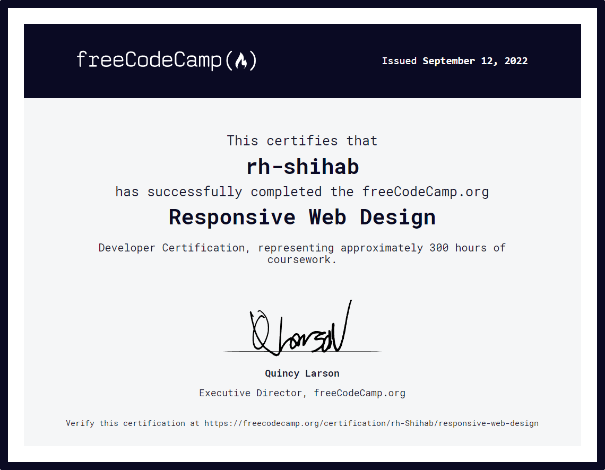

# freecodecamp-journey

This repo documents all the certification projects required for Freecodecamp's [Responsive Web Design](https://www.freecodecamp.org/learn/2022/responsive-web-design/) course

[Click here](https://rhshihab.github.io/freecodecamp-journey/) to see the live demo.

I will be adding more projects as I proceed with the course.

## Certificate:

[Click here](https://www.freecodecamp.org/certification/rh-Shihab/responsive-web-design) to verify this certificate.